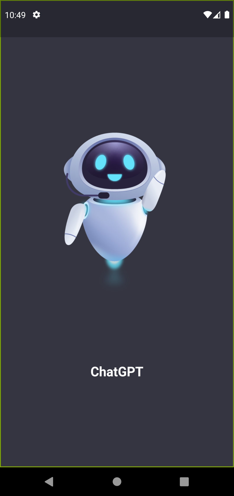
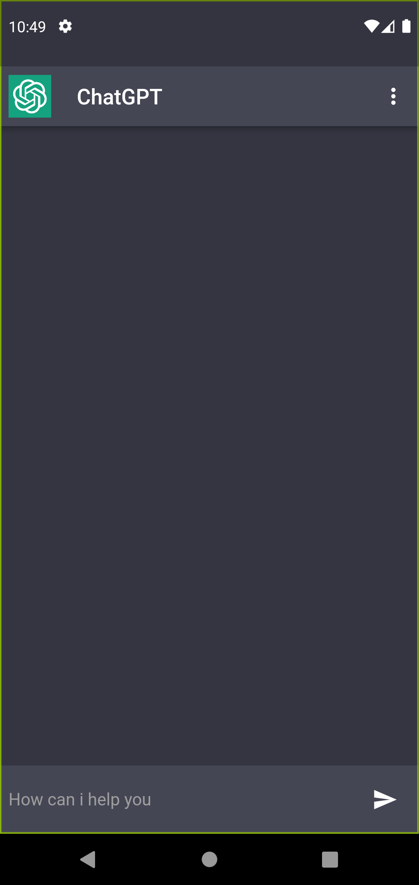
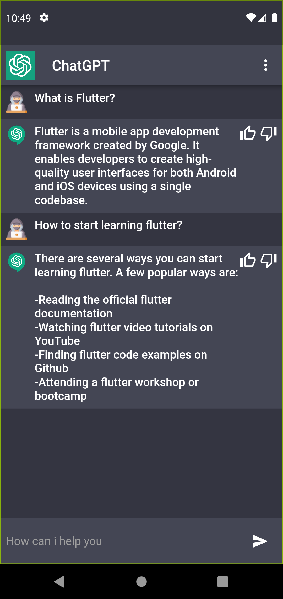

# OpenAi ChatGPT Flutter

A Flutter app that lets you chat with OpenAi API's ChatGPT. Easy to use and Simple Interface.

OpenApi Documentation. [Click here](https://platform.openai.com/docs/introduction/overview) 

## Libraries & Tools Used.
- [provider](https://pub.dev/packages/provider/install): Version-6.0.5
- [lottie](https://pub.dev/packages/lottie): Version-2.2.0
- [http](https://pub.dev/packages/http): Version-0.13.5
- [flutter_spinkit](https://pub.dev/packages/flutter_spinkit): Version-5.1.0
- [animated_text_kit](https://pub.dev/packages/animated_text_kit): Version-4.2.2

## Getting Started
First you need to add your own OpenAi Api key in `lib >services >api_services.dart`.

To get your Api Key [Click Here](https://platform.openai.com/account/api-keys)
 >Add your own OpenAi Api Key in `const String _Api_key = "YOUR API KEY";`

## App Screenshot
  

